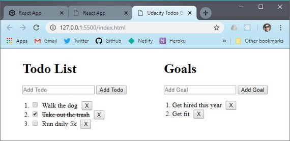

# Redux Todo & Goals App

This is a proof-of-concept Redux-like Todo app. It uses simple html and a store to provide the following:

- state tree
- getting state
- listening for changes to state
- updating state

The app also uses reducers and action creators in order to manage state properly.

## Installation

The packages included are dev libraries to provide linting and code formatting. These can be installed with the following:

```bash
npm install
```

## Usage

All code is contained in the index.html file. (Not my first choice but this was in the specs of the exercise.)

There is no build process or development server. The app can be run with a local http server such as node's [http-server](https://www.npmjs.com/package/http-server), Python's [Simple HTTP Server](https://www.pythonforbeginners.com/modules-in-python/how-to-use-simplehttpserver/) or other.

You can read [these instructions](https://threejs.org/docs/#manual/en/introduction/How-to-run-things-locally) on how to set up one of these servers.

## Screenshot

[](./images/rr31.jpg)